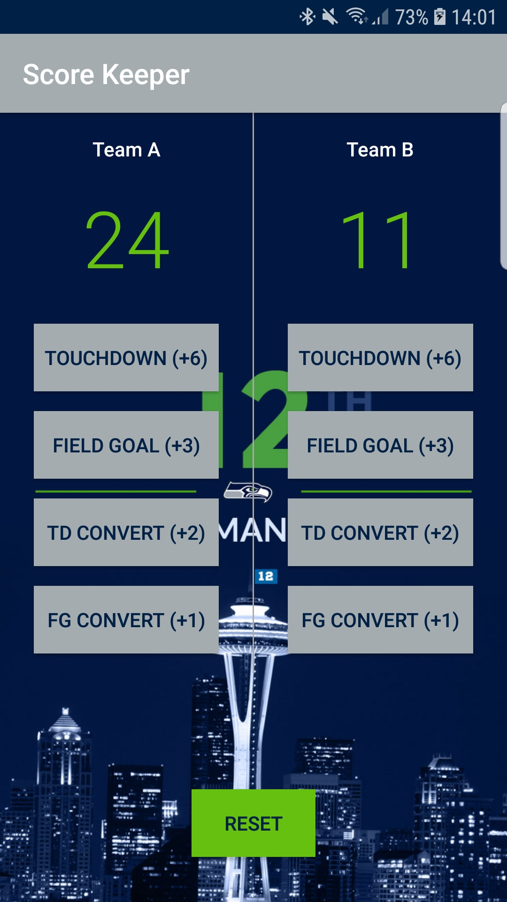

# Score Keeper
Score Keeper App for Udacity's Android Basics Nanodegree Program  
**Author**: Earl Jay Caoile  
**Version**: 1.0.0

## Overview
This Android app demonstrates the use of buttons to keep track of scores for 2 American football teams.

## Getting Started
The following is required to run the program.
1. Android Studio or any IDE that supports Android software development (XML and Java)
2. Java JDK
3. A working emulator or Android phone to use the app

## Example

## Happy Path
 - open application in Android Studio
 - start app by pressing green play button
 - press buttons
 - close app and smile

## Architecture
This application was created using Android Studio 3.1.4  
*Languages*: XML and Java  
*Type of Applicaiton*: Android Application  